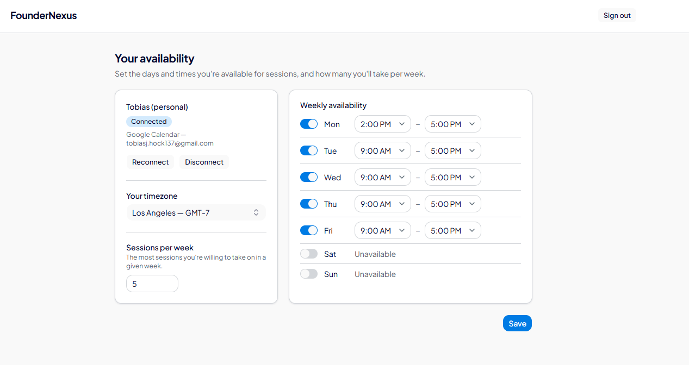
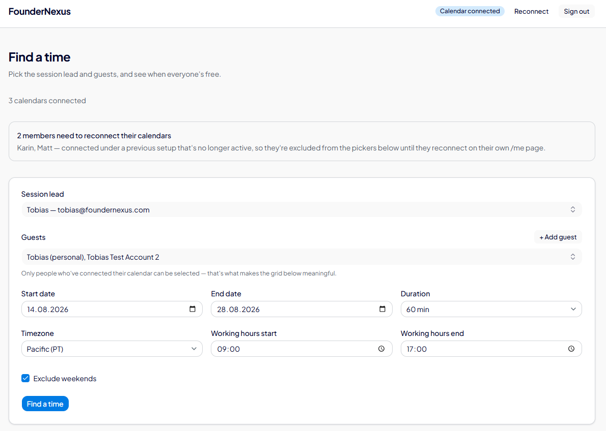
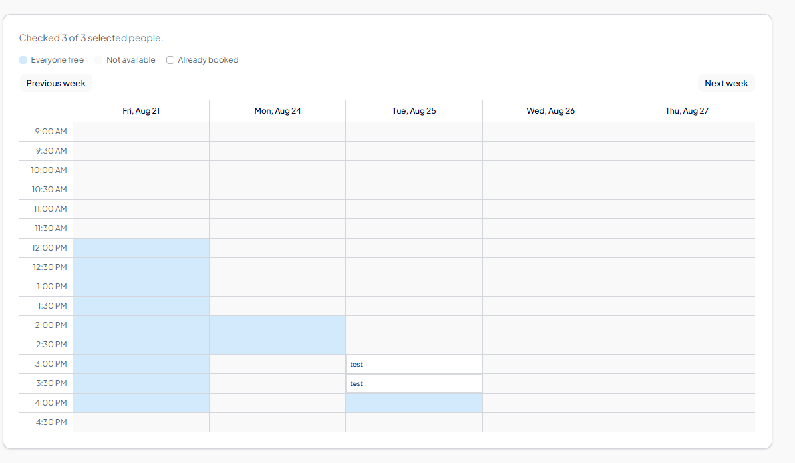

# FounderNexus Scheduler — Technical Specification

**Status:** live in production · **Last updated:** 2026-08-14
**Live:** https://fn-calendar-liard.vercel.app · **Repo:** `foundernexus/fn-calendar` · **Vercel:** FounderNexus team → `fn-calendar`

---

## 0. Access — how to get in

**Sign in: https://fn-calendar-liard.vercel.app/connect**

Same entry point for everyone. Enter your work email, connect Google / Microsoft / iCloud, and you land on
`/me` (member) or `/admin/find-a-time` (admin).

⚠️ **There is no self-signup.** An address with no `members` row gets
`"No matching member found. Contact an admin to be added."` Sending someone the link is not enough on its own.

**To add someone — two ways:**

1. **From the admin UI (normal path).** On `/admin/find-a-time`, the "Add guest" dialog registers a person by
   name and email via `POST /api/admin/members`. No code change, no deploy. **This dialog *is* the invite** —
   there is deliberately no email-invite system, so you register them and then send them the link yourself over
   Slack or text. They stay invisible to the guest picker until they actually connect a calendar.
2. **Via the seed script.** Add them to `SEED_MEMBERS` in `src/db/seed.ts` and run `npm run db:seed`. Useful for
   bulk or for setting `isFacilitator`, which has no UI.

**Admin access is separate and has no UI at all.** It comes from the `ADMIN_EMAILS` env var in Vercel, and needs
a redeploy — read §14 first, that variable is write-only and overwriting it blind drops existing admins.

You must OAuth with the **same address** you were registered under. The callback verifies the Google/Microsoft
account matches before granting anything, so signing in with a personal account fails even if your work address
is allowlisted.

Removing this whole two-step is exactly what §10.1 is about.

---

## 1. What this is and why it exists

Booking an expert session between a facilitator and several founders used to mean an email poll: propose times,
wait, collect replies, discover a clash, repeat. This tool removes that loop.

Members connect their real calendar once. An admin then picks a session lead and a set of guests, and sees — in
one grid — every time slot where **all** of them are genuinely free. Clicking a slot creates the real calendar
event and sends real invites immediately.

The core design commitment, which shapes almost every decision below: **we read free/busy only, never event
content.** The app cannot see titles, attendees, or descriptions of anyone's existing meetings. This is enforced
structurally — there is exactly one Nylas availability call in the codebase and it returns time ranges only.

---

## 2. Stack

| Layer | Choice |
|---|---|
| Framework | Next.js 16.3.0, App Router, Turbopack |
| Runtime | React 19.2.8, TypeScript, Node 24 |
| Database | Neon Postgres via `@neondatabase/serverless` (HTTP driver) |
| ORM | Drizzle 0.45 + drizzle-kit migrations |
| Calendar | Nylas v8 SDK (Google / Microsoft / iCloud behind one hosted auth page) |
| UI | Tailwind v4, Base UI, shadcn-style components, sonner toasts |
| Validation | Zod 4 on every request body |
| Tests | Vitest — 64 tests across 6 files |
| Hosting | Vercel (auto-deploys on push to `main`) |

**Note on the Neon HTTP driver:** it does not support multi-statement transactions. Several routes are written to
degrade safely because of this — see `api/me/route.ts:64-68` for the reasoning behind its deliberate
upsert-then-delete ordering.

---

## 3. Data model

Five tables. Full definitions in `src/db/schema.ts`; migrations in `drizzle/`.

### `members`
The roster. A person must have a row here before they can sign in at all.

| Column | Notes |
|---|---|
| `email` | Unique, always normalised through `normalizeEmail()` before read or write |
| `full_name` | Display name |
| `role` | `member` \| `admin` — **descriptive metadata only, grants nothing.** See §4 |
| `is_facilitator` | Gates who can be picked as "Session lead". A curated subset — connecting a calendar does not make you one. **No UI; set via seed or SQL** |
| `timezone` | **Nullable on purpose.** `NULL` means "has never saved `/me`", which is treated as *unrestricted* rather than *unavailable* |
| `weekly_session_cap` | Default 5. Applies to guests only, never the session lead |

### `calendar_connections`
One row per Nylas grant. A member reconnecting produces additional rows over time; queries resolve to the newest.

| Column | Notes |
|---|---|
| `nylas_grant_id` | Unique. The Nylas handle for the connected account |
| `provider` | Free text, not an enum — stores whatever Nylas reports, so a new provider needs no migration |
| `grant_email` | **The address actually connected**, which may differ from `members.email` |
| `nylas_client_id` | Which Nylas app minted this grant. `NULL` = pre-dates the column, treated as stale |
| `connection_status` | `connected` \| `revoked` |

A connection is only *usable* when `connection_status = 'connected'` **and** `nylas_client_id` matches the
currently configured `NYLAS_CLIENT_ID` (`isConnectionUsable`, `queries.ts:125`). Grants do not survive a move
between Nylas apps (Sandbox → Production, or an app rotation), so a row can read "connected" and still be dead.
The UI surfaces this as a distinct *needs reconnect* state rather than silently failing.

### `member_availability`
A member's own stated weekly windows, set on `/me`. One row per enabled day.

**Absence of a row means that day is off** — there is no separate `enabled` boolean to keep in sync. Times are
`"HH:mm"` strings; `day_of_week` is 0=Sunday..6=Saturday throughout the codebase.

### `events`
Sessions booked through the tool.

`idempotency_key` is unique and is the real duplicate-booking guarantee. It hashes the sorted guest IDs + slot
start + duration. **The organizer is deliberately excluded from the hash** — the same guests at the same time is
a duplicate regardless of who leads it.

### `event_attendees`
Join table, unique on `(event_id, member_id)`.

⚠️ `response_status` exists in the schema but **is never read or written** anywhere in the application. There is
no webhook ingest, so RSVPs made in Google/Outlook do not flow back. Treat it as a placeholder.

---

## 4. Authentication and authorisation

This is the most security-sensitive part of the system and the part most likely to be misunderstood. Read this
section before touching auth.

### Admin access comes from an env var, not the database

`ADMIN_EMAILS` is a comma-separated allowlist in Vercel's environment config. `isAdminEmail()`
(`src/lib/auth/admin.ts:15`) splits it, normalises each entry, and checks membership.

**`members.role` does not grant admin access.** It is descriptive only — `schema.ts:29` says so explicitly.
Someone can be `role = 'admin'` in the database and have no admin access whatsoever, and vice versa. This trips
people up constantly.

### Typing an email proves nothing

Every login — member or admin, first or thousandth — goes through a full Nylas OAuth round trip.
`POST /api/connect/start` decides only *which state-token tag* to use (`redirectTo: "admin"` or nothing) and
**grants nothing by itself**.

The admin session is minted in exactly one place: `/api/nylas/callback`, and only after confirming both that

1. the Google/Microsoft account actually signed into matches the member's registered email exactly, and
2. the address is *still* on the live allowlist (in case it was removed during the 10-minute OAuth window).

On mismatch it bails out **before touching `calendar_connections`** — so an attacker who starts the flow for
someone else's `memberId` but authenticates as themselves cannot overwrite that person's real connection.

### Sessions

Two HMAC-SHA256 signed cookies, both keyed on `SESSION_SECRET`, both carrying a `purpose` tag so a token minted
for one use can never be replayed as another:

| Cookie | TTL | Meaning |
|---|---|---|
| `fn_admin_session` | 8 hours | Short — shared-context login |
| `fn_member_session` | 90 days | Long — a member logs in once by connecting a calendar |

`SESSION_SECRET` is the one env var with an enforced minimum (32 chars, `env.ts:25`) — a weak value here means
forgeable admin sessions.

An admin who is also a member can legitimately hold both cookies at once, which is why `POST /api/logout` clears
both unconditionally rather than just the one it thinks is active.

### Two-layer route protection

`src/proxy.ts` matches `/admin/*`, `/api/admin/*`, `/me/*`, `/api/me/*` and re-checks the **live** allowlist on
every request, so removing someone from `ADMIN_EMAILS` takes effect on their next request rather than when their
cookie expires.

Every admin page and route additionally calls `requireAdminSession()` itself, per Next.js's own guidance not to
rely on middleware alone — a matcher edit or a moved route would otherwise silently remove protection.

---

## 5. User workflows

### 5.1 Member — connecting a calendar

```
/connect  →  enter email  →  POST /api/connect/start
                                     │
                    ┌────────────────┴────────────────┐
              not in members                    found in members
                    │                                 │
     "No matching member found.            Nylas hosted auth (Google /
      Contact an admin to be added."        Microsoft / iCloud picker)
                                                      │
                                        /api/nylas/callback
                                                      │
                                   upsert calendar_connections
                                    + mint member session cookie
                                                      │
                                        redirect → /me
```

On `/me` a member sets their timezone, their weekly availability windows (one time range per enabled day), and
their weekly session cap. They can also disconnect or reconnect.



Note what the left card shows: the **connected account** (`tobiasj.hock137@gmail.com`) is a different address from
the registered member — exactly the `grant_email` vs `members.email` distinction in §3. Days toggled off read
"Unavailable" and simply have no `member_availability` row.

⚠️ **Disconnect is a local flag only.** `POST /api/me/disconnect` marks rows `revoked`; it does **not** call Nylas
to revoke the real OAuth grant. The grant stays live on Nylas's side.

### 5.2 Admin — booking a session

```
/connect (same entry point, admin email)  →  OAuth  →  /admin/find-a-time
                                                              │
              pick session lead (facilitators only) + guests + date range
                    + duration (30/45/60) + working hours + timezone
                                                              │
                                            POST /api/admin/availability
                                                              │
                                                   availability grid
                                                              │
                                        click a slot → create-event dialog
                                          (title, description, meeting URL)
                                                              │
                                              POST /api/admin/events
                                                              │
                              real Nylas event + real invites sent immediately
```



Two things in this screenshot are worth reading closely:

- **The reconnect banner.** "Karin, Matt — connected under a previous setup that's no longer active" is the stale
  `nylas_client_id` state from §3 rendered in the UI. They are excluded from the pickers until they reconnect on
  their own `/me` page. This is a live condition, not a mock.
- **"Only people who've connected their calendar can be selected."** The guest picker deliberately hides
  unconnected members, because a person with no connection contributes nothing to the intersection.

There is **no dry-run mode.** Clicking confirm sends real calendar invites to real people.

---

## 6. The availability algorithm

`POST /api/admin/availability` applies four independent layers. Understanding that these are *separate* explains
most "why is this slot missing?" questions.

**Layer 1 — real calendar free/busy (Nylas).**
A single collective-availability call where every participant must be free. Constrained by the admin's date
range, working hours, duration, and optional weekend exclusion. Interval is 30 minutes
(`AVAILABILITY_INTERVAL_MINUTES`), and `roundTo` must match it exactly or returned slots land between grid rows
and silently fail to render.

Participants are deduped by `grant_email`, **not** member ID — two members could share one connected account.

**Layer 2 — each member's own stated windows.**
Nylas has no idea someone set "Mondays 2–5pm only" on `/me`. Every selected member — lead *and* guests — must
independently clear their own window, evaluated **in their own timezone**, because "2pm" means 2pm where they
are, not where the admin searched.

**Layer 3 — weekly session cap (guests only).**
Each guest's already-confirmed sessions are bucketed into weeks in their own timezone (weeks start Sunday) and
compared against `weekly_session_cap`. Never applied to the session lead — running several sessions a week is a
facilitator's job, and capping them would block their normal workload.

The DB fetch uses a **±7 day buffer** around the search range: a slot near either edge belongs to a week
extending up to 6 days beyond it, and a narrower buffer silently undercounts.

**Layer 4 — sessions already booked through this tool.**
Surfaced as distinct "already booked" cells so an admin sees *why* a slot is unavailable instead of an
unexplained gap.

### Response fields worth knowing

| Field | Meaning |
|---|---|
| `notConnectedNames` | Selected people with no usable connection. Does **not** block the search |
| `checkedCount` / `totalSelected` | Counted in *people*, deliberately not calendars |
| `filteredByPreferences` | `true` when Nylas found real overlap but every slot was removed by a stated `/me` window — lets the UI avoid falsely claiming "no overlapping free time" |

---

## 7. Why it must be a grid — design rationale

**This is a product requirement, not an implementation detail.** It gets questioned by every engineer who sees
it ("why not just return the best three slots?"), so the reasoning is recorded here.

The obvious alternative is a ranked list: compute valid slots, sort them, show the top few. That is cheaper to
build and worse at the actual job.



**Read that screenshot before arguing for a list.** Three legend states — everyone free, not available, already
booked — and the week tells a story a list cannot:

- **Friday 21st is wide open** from noon to 4:30.
- **Monday 24th offers exactly one hour**, 2:00–3:00.
- **Tuesday 25th** has a session already booked at 3:00 and one free slot at 4:00.
- **Wednesday and Thursday are solid walls.** Nothing, all day, for anyone.

A ranked list of this same data returns about six rows and conveys none of it. The admin cannot see that moving
the session to Friday makes the problem disappear, or that pushing into the following week is pointless because
midweek is structurally blocked. Seven reasons this matters:

**1. Zero results is the common case, and a list has nothing to say about it.**
With six or more busy people, "everyone is free" is often empty. A list renders as "no times available" and the
admin is stuck with no next move. A grid renders the *shape* of the problem — Tuesday afternoon is almost clear,
Thursday is a wall — which is information the list literally cannot carry.

**2. Empty cells localise the blocker.**
Scheduling is a negotiation about who moves. The useful question is rarely "when is everyone free" but "who is
stopping this from working, and can they move?" A grid where one cell is blocked by one person turns a dead end
into a decision: ask that person to shift. You cannot form that thought from an empty list.

**3. Humans read time grids natively.**
Everyone has used a week view. Density, clusters, "mornings are hopeless" — these emerge from a grid at a glance
and require conscious reconstruction from a list. The grid is not a visualisation of the answer, it *is* how
people think about time.

**4. Trust, which is really an adoption argument.**
When a tool says "no times available", people do not believe it. They go back to the email poll — which is the
exact behaviour this product exists to eliminate. When they can *see* the wall of conflicts, they accept it and
change the input instead. The grid is what keeps people inside the tool on a bad day.

**5. Layer 4 only means anything positioned in time.**
"Already booked" cells exist to answer *why* a slot is unavailable. That answer needs a location on a time axis.
In a list it degrades to a footnote nobody reads.

**6. Ranking hides the criteria.**
A "best slot" score has to encode judgements the tool does not have — that this founder matters more, that this
one can catch up async, that Friday afternoons are bad for reasons no calendar knows. Surfacing the raw picture
and letting the admin decide is more honest than inventing a ranking that pretends to know.

**7. — and this is the direct answer to "should it show that the majority has time?" —**

**Partial availability is not an alternative to the grid. It is a feature that can only exist inside one.**

"Seven of nine are free here" needs somewhere to live. In a grid it is a colour intensity, a fraction in the
cell, a hover listing who is missing — the grid is the container that makes the information legible. In a list
it is a number floating without context, and you still cannot see whether the two missing people are missing
across the whole week or just that hour.

So the answer is *yes, and*: we want majority-availability, and building it is a reason to keep the grid, not to
replace it.

### Implementing majority availability — notes for whoever picks this up

Not built today, and it is not a small change:

- Nylas's **collective** method returns only slots where *everyone* is free. Slots with partial overlap never
  reach us at all, so they cannot simply be styled differently — they do not exist in the response.
- Getting them requires either a different availability method or per-participant free/busy calls, with the
  overlap counting done in our own code.
- The per-slot participant list is *already* returned by Nylas and captured in the `AvailabilitySlot` type as
  `emails`, but `api/admin/availability/route.ts` drops it when mapping the response. That field is the natural
  carrier for "who is free here" and plumbing it through is the cheap first half of the work.
- Decide up front whether a partially-available slot is **bookable**. If it is, Layer 3's weekly-cap check and
  the booking route's re-validation both need to know it, or an admin can book a session for someone the search
  already knew was busy.

---

## 8. Booking and idempotency

`POST /api/admin/events`:

1. Drops the lead from the guest list if present, so the hash, Nylas participants, and `event_attendees` all
   agree.
2. Computes the idempotency key and fast-path checks for an existing row (an optimisation, *not* the guarantee).
3. Re-verifies the lead is connected and is a facilitator — the UI filters client-side, which is not a guarantee.
4. **Re-checks every guest's weekly cap**, because the grid may be stale or another admin may have booked
   concurrently.
5. Creates the Nylas event on the **lead's grant** with `notifyParticipants: true`.
6. Inserts `events`, then `event_attendees`.

Invitees are addressed by `grant_email` where available, falling back to `members.email`. This matters:
availability was checked against the connected calendar, so inviting a different address would invite a calendar
nobody verified as free.

### Known failure modes (accepted for V1, all logged)

- **Lost idempotency race.** Two concurrent requests both pass the pre-check; the unique constraint stops the
  second insert, but its Nylas event was already created and is now orphaned — a real calendar event no DB row
  references.
- **`event_attendees` insert fails after `events` succeeded.** Invites are already out. Returns success rather
  than implying nothing happened.
- Every path after the Nylas call reports honestly that invites may already have been sent.

**Limit:** 49 guests + 1 lead = Nylas's 50-participant cap.

---

## 9. Can we sync several calendars per person?

**Not today — on two separate axes. Both are fixable.**

### Axis 1: one connected *account* per member

`getLatestConnections()` (`queries.ts:150`) runs `SELECT DISTINCT ON (member_id) … ORDER BY member_id,
connected_at DESC`. A member may accumulate many `calendar_connections` rows, but **only the most recent is ever
used.** Connecting a second account silently supersedes the first.

### Axis 2: only the *primary* calendar within that account

`src/lib/nylas.ts:81` pins every participant to `calendarIds: ["primary"]`. A secondary calendar in the same
Google account — a separate "Coaching" or "Personal" calendar — is invisible to the availability check. Busy time
there will **not** block a booking.

⚠️ This is the highest-impact known defect. It presents as a double-booking, which reads to the user as the tool
being broken rather than as a configuration limit.

### What each fix requires

| Goal | Work |
|---|---|
| **Multiple calendars in one account** (most people's actual need) | Fetch the grant's calendar list via Nylas, let the member tick which to include on `/me`, persist the selection, pass those IDs instead of `["primary"]`. No schema change to `calendar_connections`. Small-to-medium. |
| **Multiple accounts per member** (work + personal Google) | Drop the `DISTINCT ON` collapse, allow N active grants per member, and pass every grant email as a participant. Touches `getLatestConnections`, `getActiveConnections`, `getMemberConnectionState`, and every connection-state UI. Medium — the "one connection" assumption is load-bearing across the codebase. |

**Recommendation:** ship the first. It covers the common case (people who keep several calendars inside one work
account) at a fraction of the cost, and is additive rather than a refactor.

---

## 10. Integrating into FounderNexus

Two placements are planned. Both are straightforward *product* changes; the real work in both cases is
**identity**.

### 10.1 "Connect your calendar" in the Founder profile

Today `/connect` asks for an email and requires a pre-existing `members` row. Inside FounderNexus the founder is
already authenticated, so asking them to retype their address is redundant and the "Contact an admin to be added"
dead-end is unacceptable.

**Required changes:**

1. **Signed handoff instead of email entry.** FounderNexus mints a short-TTL HMAC token carrying the founder's
   identity and redirects to `/connect?token=…`. Reuse the existing `signValue`/`verifyValue` helpers in
   `src/lib/auth/session.ts` with a new `TOKEN_PURPOSE` tag — the primitive is already there and already
   purpose-tagged.
2. **Auto-provision the member row.** On a valid handoff, upsert into `members` rather than rejecting. This
   replaces both the seed script and the Add-guest dialog as the way people enter the system.
3. **Decide redirect vs embed.** A full-page redirect is simplest and avoids third-party-cookie problems in an
   iframe. Nylas hosted auth cannot be iframed anyway, so a redirect is needed for at least part of the flow
   regardless.
4. **Post-connect return URL.** The callback currently hardcodes `/me`. It should return the founder to their
   FounderNexus profile. Make the destination part of the signed state.

### 10.2 Admin view in the Create Session dashboard

`/admin/find-a-time` is the whole scheduling UI and can move largely as-is.

**Required changes:**

1. **Replace `ADMIN_EMAILS` with a FounderNexus role claim.** An env var allowlist does not scale past a handful
   of people and requires a redeploy for every change. The check is centralised in one function (`isAdminEmail`)
   plus `proxy.ts`, so the blast radius is small.
2. **Expand the timezone list.** `TIMEZONES` in `src/lib/time.ts` offers only four US zones for admin search.
   Members can already set any IANA zone on `/me`. If founders are international this must grow.
3. **Facilitator management UI.** `is_facilitator` currently has no admin interface.
4. **Keep the two-layer auth pattern.** Whatever replaces the allowlist should still be checked both in
   middleware and inside each route.

### 10.3 Sequencing

Identity handoff first (§10.1 items 1–2), because it unblocks real founders self-serving. The admin dashboard
move can follow independently — it has no dependency on the founder-side work.

---

## 11. Roadmap

Ordered by a rough read of impact over cost. Items 1–3 are agreed direction; item 5 is exploratory and should
not be built against without a decision.

| # | Item | Why | Size |
|---|---|---|---|
| 1 | **Multiple calendars per account** (§9, axis 2) | Prevents silent double-bookings — the one current defect that looks like the tool is broken | S–M |
| 2 | **Identity handoff from FounderNexus** (§10.1) | Removes the manual add-a-member step that gates every new founder | M |
| 3 | **Admin view in Create Session** (§10.2) | Puts scheduling where the work already happens; needs the role-claim change | M |
| 4 | **Majority availability on the grid** (§7) | Turns an empty result into a usable one; the most requested behaviour change | M–L |
| 5 | **In-person sessions & venue booking** | Exploratory — see below | L, unscoped |

### On item 5 — in-person sessions

Under discussion, not designed. The idea is to bring founders together physically (initial thought: a WeWork in
Texas) rather than only over video.

Two things the dev team should know before anyone scopes it:

- **The scheduling problem changes shape.** Today the unit is a 30–60 minute slot found by intersecting free/busy.
  In-person means finding *a day or block of days* when N people can all be in one city, plus travel either side.
  That is a different search, not a new field on the existing one. The room booking is the last 10% of the work.
- **A WeWork Partner API does exist** (developers.wework.com) and covers realtime availability and booking, but it
  is not self-serve — it requires an approved partnership and is aimed at distribution partners who resell space,
  not at members booking their own membership. Treat availability of that API as an open question, not a given.

Nothing in the current schema models place: `events` has `meeting_url` and no venue, capacity, or location
concept at all.

---

## 12. Known limitations

- **No cancellation or rescheduling.** `events.status` has a `cancelled` value but no route ever sets it.
- **No webhook sync.** RSVPs, edits, and deletions made directly in Google/Outlook never flow back.
  `response_status` is inert.
- **Disconnect does not revoke the Nylas grant** (§5.1).
- **Slots spanning local midnight are dropped** for members far from the search timezone. `/me` windows cannot
  cross midnight, so this is mathematically correct but can exclude hours a member would accept. No way to
  express an overnight window.
- **Members who never saved `/me` are unrestricted**, not blocked — deliberate, so existing members were not
  locked out when the feature shipped.
- **Admin search is limited to four US timezones.**
- **No email invites.** Registering someone hands the admin a link to pass along themselves.
- **`is_facilitator` has no UI.**
- **A stale comment** in `src/app/api/me/disconnect/route.ts:7` references an open `/api/connect/disconnect`
  route that no longer exists. Harmless, worth deleting.

---

## 13. API reference

All routes are Next.js App Router handlers under `src/app/api/`. Every body is validated with Zod; validation
failures return `400` with `{ error }` carrying the first issue's message.

| Method | Path | Auth | Request | Success response |
|---|---|---|---|---|
| `POST` | `/api/connect/start` | none | `{ email }` | `{ url }` — Nylas hosted auth URL |
| `GET` | `/api/nylas/callback` | none (OAuth) | `?code&state` | `302` → `/me` or `/admin/find-a-time`, sets session cookie(s) |
| `POST` | `/api/logout` | none | — | `{ status: "ok" }`, clears **both** cookies |
| `PATCH` | `/api/me` | member | `{ timezone, weeklySessionCap, availability[] }` | echoes the saved settings |
| `POST` | `/api/me/disconnect` | member | — | `{ status: "revoked" }` (local flag only) |
| `POST` | `/api/me/reconnect` | member | — | `{ url }` — hosted auth, member from session |
| `POST` | `/api/admin/availability` | admin | search params — see below | `{ slots[], checkedCount, totalSelected, notConnectedNames[], filteredByPreferences, bookedSlots[] }` |
| `POST` | `/api/admin/events` | admin | `{ organizerMemberId, guestMemberIds[], title, description?, meetingUrl?, startsAtUnix, durationMinutes, timezone }` | `{ event, alreadyExisted }` |
| `POST` | `/api/admin/members` | admin | `{ fullName, email }` | `{ member }` · `409` if the email exists |
| `POST` | `/api/admin/connect-calendar` | admin | — | `{ url }` — for an admin connecting their *own* calendar |

**`/api/admin/availability` request body:** `organizerMemberId`, `guestMemberIds[]` (1–49, no duplicates),
`startDate`, `endDate` (`YYYY-MM-DD`, ≤60 days apart), `durationMinutes` (30 | 45 | 60), `workingHoursStart`,
`workingHoursEnd` (`HH:mm`, must fall on a 30-minute boundary), `timezone` (one of the four supported),
`excludeWeekends`.

**Notable status codes:** `401` unauthorised · `409` duplicate member · `502` Nylas unreachable ·
`500` after a real Nylas event was created but the DB write failed — the message says so explicitly.

Note that `/api/admin/availability` returns `200` with an `error` field for some business-rule failures (lead not
connected, lead not a facilitator) rather than a `4xx`, because the UI renders them inline alongside an empty
result.

---

## 14. Operations

### Local setup

```bash
git clone https://github.com/foundernexus/fn-calendar.git
cd fn-calendar
npm install
cp .env.example .env.local
```

Then fill in `.env.local`:

| Variable | Where it comes from |
|---|---|
| `DATABASE_URL` | Neon connection string (pooled) |
| `NYLAS_API_KEY`, `NYLAS_CLIENT_ID` | Nylas dashboard → your application |
| `NYLAS_API_URI` | `https://api.us.nylas.com` |
| `NYLAS_CALLBACK_URI` | `http://localhost:3000/api/nylas/callback` — **must also be registered as a redirect URI in the Nylas dashboard**, or the OAuth round trip is rejected |
| `ADMIN_EMAILS` | Comma-separated; include your own address to reach `/admin` |
| `APP_URL` | `http://localhost:3000` |
| `SESSION_SECRET` | Any random string ≥32 chars — `openssl rand -hex 32` |

```bash
npm run db:migrate   # apply schema
npm run db:seed      # register yourself as a member
npm run dev
```

⚠️ **There is no separate dev database.** `.env.local`'s `DATABASE_URL` currently points at **production**. Local
`db:seed` and any local script using that connection string write to live data. If you want a real dev
environment, create a second Neon branch and point your local `.env.local` at it before running anything.

Note that a Nylas grant is bound to the Nylas app that created it, so a connection made against a local/Sandbox
app will not work in production and vice versa — that is what `nylas_client_id` and the *needs reconnect* state
in §3 are for.

### Environment variables in production

Set in Vercel under FounderNexus → `fn-calendar` → Settings → Environment Variables, for Production and Preview.
**Env changes require a redeploy** to take effect.

⚠️ **`ADMIN_EMAILS` is marked Sensitive, which makes it write-only** — the dashboard shows an empty field and
copy-to-clipboard is disabled. Overwriting it therefore destroys the previous value with no way to read it back
first. On 2026-08-14 this caused an admin to be silently dropped.

**Always reconstruct the current value before editing.** Method: `POST {"email":"…"}` to `/api/connect/start`,
take the `state` param from the returned URL, base64url-decode its first segment, and check for
`redirectTo: "admin"`. Previous deployments retain the env vars they were built with, so an already-overwritten
value can be recovered by probing the old deployment URL — though those sit behind Vercel deployment protection
and must be called from an authenticated browser session.

### Deploys

Push to `main` → Vercel auto-deploys. Confirmed working.

### Commands

```bash
npm run dev          # local dev server
npm run build        # production build
npm test             # vitest, 64 tests
npm run lint
npm run db:generate  # generate a migration from schema changes
npm run db:migrate   # apply migrations
npm run db:seed      # upsert the seed member list
```

---

## 15. Test coverage

64 tests across 6 files, concentrated on the logic most prone to silent regression:

| File | Covers |
|---|---|
| `lib/time.test.ts` | Timezone conversion, availability-window matching, weekly-cap bucketing, date arithmetic |
| `lib/auth/session.test.ts` | Sign/verify, purpose-tag mismatch, expiry, malformed input |
| `lib/auth/admin.test.ts` | Allowlist parsing and normalisation |
| `lib/idempotency.test.ts` | Key stability and ordering independence |
| `lib/email.test.ts` | Normalisation |
| `lib/timezones.test.ts` | Supported-zone validation |

The deliberate gap is anything requiring a live Nylas call. Route handlers are covered indirectly through their
pure helpers.
